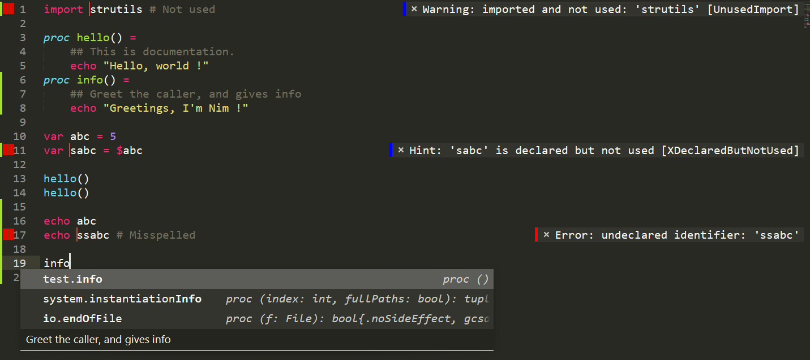

SublimeNim
=======

Nim Programming Language plugin for Sublime Text 4

Requires version 4073 or higher.

- Q: Why not use NimLime ?
- A: NimLime dropped support for NimSuggest and Nimble (in order to update to Sublime Text 3 if I understand currently.)
The project looks dead now (or at least, it's not updated much), so I decided to create my own nim package which targets *Sublime Text 4* and makes use of all the cool new APIs.

Features
--------

* Syntax highlighting
* Highlight errors (Using `nim check`)
* Show tooltips with type informations
* Goto Definition (link inside tooltip)
* Autocompletion (based on `nimsuggest`)
* Shows your documentation
* Keyshortcuts for building and generation documentation



Installation
------------

*Package Control* is required. Find how to install it here: https://packagecontrol.io/installation
If you have other packages installed, you probably also have already installed *Package Control*.

1. <kbd>Ctrl</kbd>+<kbd>Shift</kbd>+<kbd>P</kbd> 
2. Select `Package Control: Add repository`
3. Enter URL: https://github.com/vanyle/SublimeNim
4. `Install package` 
5. `SublimeNim` 
6. `Enter`

Settings, Usage and Tips
------------------------

You should install the `ANSIescape` package to enjoy the syntax coloring of the terminal when building.
This is optional.

Depending on how much you want Sublime to behave as an IDE or as a text editor, you can toggle the following features.
You can see all the toggles inside your preference file.

Open it with: Preferences > Package Settings > SublimeNim > Settings - Default

### Error highlighting

Toggle with `sublimenim.savecheck`

After saving, will check the current file for errors. See screenshot above.

### Tooltips

Toggle with `sublimenim.hoverdescription`

Will show the types and the docstring of the variable and procedure you hover over.

### Auto completion

Toggle with `sublimenim.autocomplete`

Will propose completion options based on `nimsuggest`'s `sug` feature.

You need to enable `autocompletion` in *Sublime Text* settings

### Build shortcuts

<kbd>Ctrl</kbd>+<kbd>B</kbd> : Compile and Run the current nimble project
<kbd>Ctrl</kbd>+<kbd>Shift</kbd>+<kbd>B</kbd> : Compile the current nimble project   

You can change these with:  
<kbd>Preferences</kbd> > <kbd>Package Settings</kbd> > <kbd>SublimeNim</kbd> > <kbd>Key Bindings - Default</kbd>

Possible configuration:
```js
[
	{
		"keys":["ctrl+b"],
		"command":"run_nim" // put run_nim or run_nimble depending on if you use nim more as a scripting tool or for big projects.
	},
	{
		"keys":["ctrl+shift+b"],
		"command":"compile_nim" // same here
	},

]
```

When building, the result will be shown inside the *Sublime Text* terminal.
You might want to change this behavior. The first settings controls the regular builds and the second setting controls the nimble builds. The compilation will always occur inside the *Sublime Text* terminal, only the run command can be customized.

```js
// possible values:
// `[]` => Use the Sublime Text terminal (readonly)
// `["wt"]` => Use Windows Terminal
// `["start","cmd","/k"]` => Please use something more modern ...
// `["start","powershell","-Command"]` => Use Powershell
{
	// other values ...
	"sublimenim.nim.console":["wt"],
	"sublimenim.nimble.console":["wt"]
}
```

By default, SublimeNim does not use the *Build System* integrated into Sublime Text.
Instead, SublimeNim uses custom commands that perform the building. This allows us
to control what terminal is used to run the command and other options.

If you prefer using *Build System*, comment the lines inside the `Key Bindings - Default` files
to disable the Custom Sublime Nim building and check the option in:

<kbd>Tools</kbd> > <kbd>Build System</kbd> > <kbd>Nim</kbd>

Note that the *Build System* does not support `nimble`.

TODO
-------

- [ ] Command to run `nim pretty`


Contributing
------------

Pull requests are **not** welcome. Fork this project if you want to add stuff.
Open an issue if you have a problem.